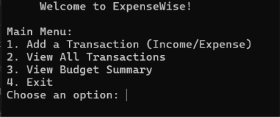
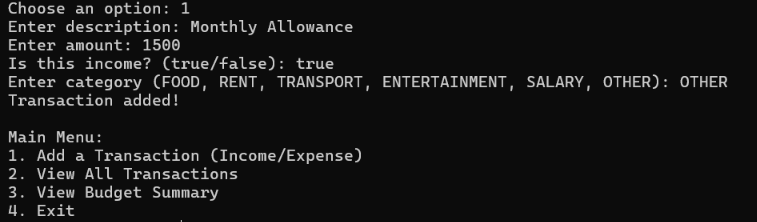
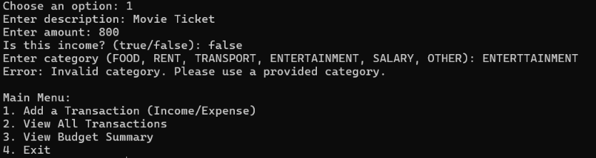
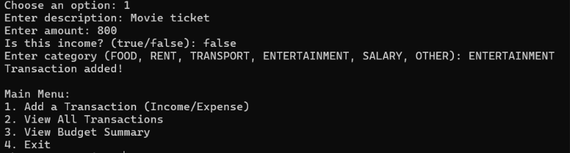
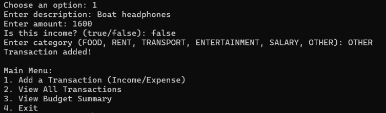
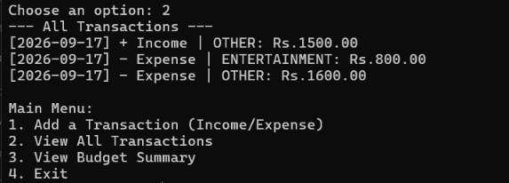
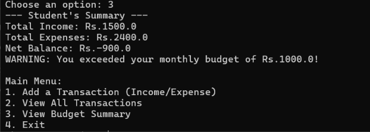
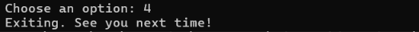

# ExpenseWise - Personal Expense Tracker & Budget Analyzer

## Overview of the Project
ExpenseWise is a lightweight, console-based Personal Finance Tracker built entirely in Core Java. It is designed to help students, freelancers, and professionals log their daily incomes and expenses, monitor monthly budgets, and analyze spending habits offline without the bloat of a heavy graphical user interface. All financial data is persisted locally via file storage.

## Features
* **User Management:** Secure profile creation and basic authentication.
* **Transaction Logging:** Quickly log incomes and categorized expenses (e.g., Food, Rent, Entertainment).
* **Budget Monitoring:** Set monthly spending limits and receive automatic alerts if a transaction exceeds the budget.
* **Reporting & Analytics:** Generate instant, text-based summaries showing expense breakdowns and total savings.
* **Persistent Storage:** Data is stored locally in human-readable files (CSV), ensuring no data is lost between sessions.

## Technologies/Tools Used
* **Language:** Core Java (JDK 8+)
* **Storage:** File I/O (CSV format)
* **Architecture:** Console-based UI, Object-Oriented Design (OOD)
* **Version Control:** Git & GitHub

## Steps to Install & Run the Project
1. Clone the repository:
   ```bash
   git clone https://github.com/devnagpal/ExpenseWise.git
   ```
2. Navigate to the project folder:
   ```bash
   cd ExpenseWise
   ```
3. Compile all Java files:
   ```bash
   javac ExpenseWiseApp.java models/*.java services/*.java utils/*.java exceptions/*.java
   ```
4. Run the application:
   ```bash
   java ExpenseWiseApp
   ```

## Instructions for Testing
You can run the automated validation tests for the core logic by running:
```bash
javac ExpenseWiseTest.java
java ExpenseWiseTest
```

## Screenshots

 
 
 
 
 
 
 
 